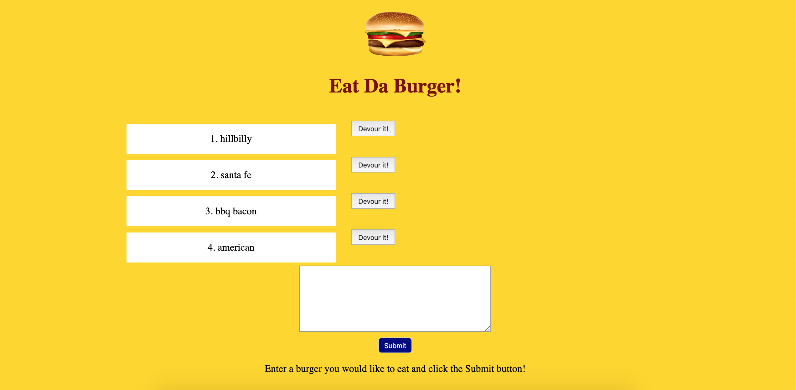
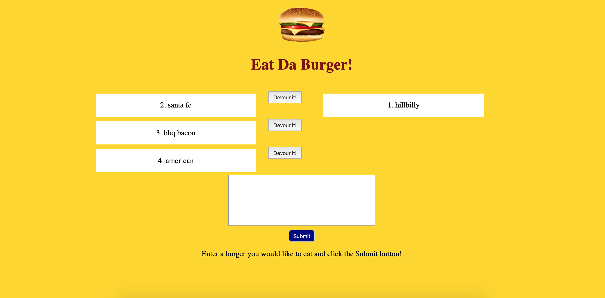

# Eat Da Burger

This is a node express handlebars app. It's purpose is to allow users to log burgers they would like to eat, and keep track of which burgers have been devoured.
When a user creates a burger or devours a burger, an api call is made from burgers.js to the router (burger_controller.js), which receives information from the body of the get, post, or update request. Then inputs that information as a variable into a function from the burger model (burger.js), which receives its functions from the orm (orm.js), where all of the connection queries are made to the database burger_db and the database is updated accordingly.

## How to use

npm install: This will install express, express handlebars, and mysql

